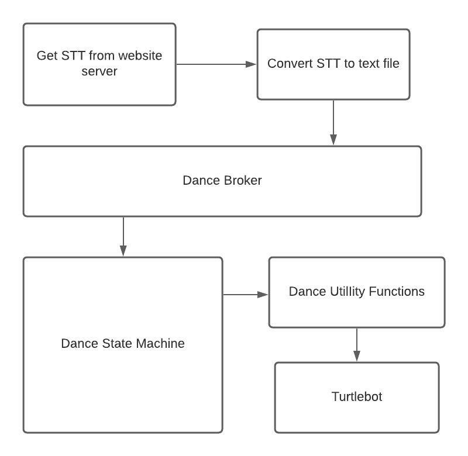
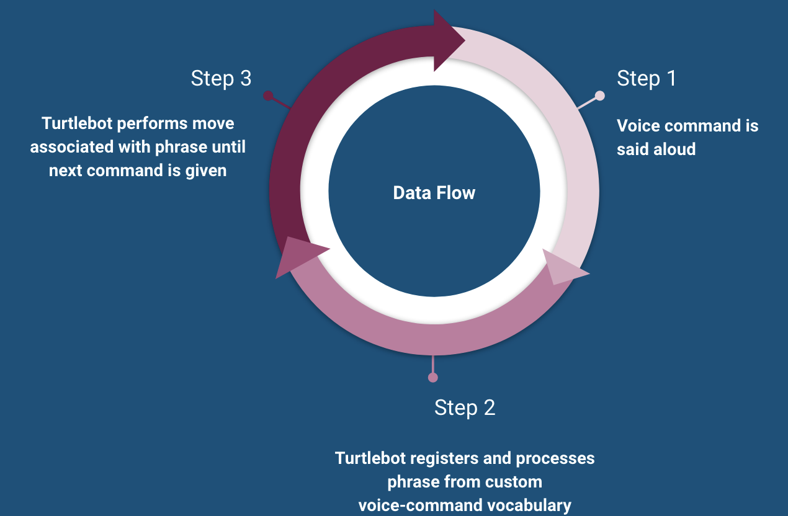

## Team Squushy 
To right! Take it back now ya'll... 
Time to make a turtlebot dance!!

### Project Vision Statement

The goal of our project is to use voice recognition to make our turtlebot do the Cha Cha Slide. We will create a library of phrases from the song for our turtlebot to react and dance along to, following the steps choreographed by DJ Casper. To do this we will use a python library which allows for the voice recognition software. We wanted to improve a simple state machine to be able to take in audio, convert it to text using Speech to Text, and then determine which state to use based on the words said. This will give the illusion that the turtlebot is dancing along with the song as it plays. 

## Glossary

**Speech to Text (STT)** - technology that enables human speech to be converted automatically into text.

**SMACH State Machine** -  SMACH is a task-level architecture for rapidly creating complex robot behavior. At its core, SMACH is a ROS-independent Python library to build hierarchical state machines.

## Design Process
To ensure the team worked efficiently and timely, we decided to use the SCRUM design process for this project. Using a Trello Board [Trello](https://trello.com/b/zSGkMq1g/final-project) we were able to organize the project into short 'sprints' for each team member. Due to the fact that this class only met once a week, it was east to assign each member their individual work for the week and what the goals for each sprint were. The benefits to using SCRUM managment for this project included, helping the team complete project deliverables quickly and efficiently, ensuring effective use of time, large projects are divided into easily manageable sprints, developments are coded and tested during the sprint review, and that SCRUM works well for fast-moving development projects. 

## Requirements
### Use Case 
**Name**: Turtle cha cha

**ID**: UC1

**Description**: Turtle bot completes user specified cha cha dance move

**Primary Actor(s)**: User

**Stakeholders & Interests: User - entertained by turtlebot **

- Pre-Conditions: Turtlebot system is active; Turtlebot has assigned routine for cha cha command; Turtlebot can hear and process commands

- Post-Conditions: Success: Turtlebot Successfully completes designated cha cha move on command; Failure: Turtlebot completes the wrong move

Trigger: Turtlebot receives a command to do the cha cha

**Main Success Scenario**:

1. The Turtle bot is active and ready to receive command.
2. User says voice command to cha cha
3. Turtlebot performs cha cha
4. Turtlebot completes cha cha and awaits next command

**Alternative Steps**:
1. Turtlebot receives another voice command and adds it to queue

**Exceptions**:
1. In step 2, instead of voice command, user manually types command

## How-to Make your Turtlebot Dance
1. Open [STT Interface](https://squushy.herokuapp.com/)
2. Play Cha-Cha Slide by Dj Casper 
3. Click the Start/Stop button
4. In the terminal on your computer run  `roscore`
5. Open a new window and cd to `catkin_ws/src` 
6. Run the line `roslaunch turtlebot3_bringup turtlbot3_robot.launch`
7. The turtlbot will read 10 words every ~20ms 
8. Watch as the turtlebot dance
9. Please note that the connect between the terminal and turtlebot will close after 30 seconds of silence, and steps 4-6 will have to be repeated.
10. To run tests run `python -m pytest`

## Risks and Quality Concerns
In hopes of producing a well thought out and well implemented project we needed to address potential risks and quality concerns. One risk we ran into early on was back ground noise negatively impacting our STT software. It distorted the words and in turn nothing was read in correctly. In addition to background noise, microphone quality also influenced the quality of the STT output. To remedy these two issues, we found an isolated vocal version of the song and switched to using our personal computers which have good quality microphones. 

Additionally, a quality concern for the project was that we are reading in a lot of lyrics at once and the code had to be efficient enough to process and perform accordingly. Since the song is not just saying the commands, but also including lyrics in between, we needed to make sure we were able to filter out unwanted words from our code. We created an additional cleaning program that took the STT and looked for key word to relate to our state functions. For example one line of the song is "Take it back now y'all". When this line is read in adn filtered it will look for a word corresponding to one of the pre-existing states, in this case the word 'back' is found and the robot knows to run the state 'backward.' 

## Architecture Diagram
An architectural diagram is a diagram of the overall outline of the software system and the relationships, constraints, and boundaries between components. It is an important tool as it provides an overall view of the physical deployment of the software system. Here is a simple diagram for our software system:

## Data Flow Diagram 
In addition to an architecture diagram we can visualize the flow of data within our programs with a Data Flow Diagram. This helps us to understand the functioning and the limits of a system. The data flow for our project is as follows: 

## Implementation and Testing
To begin to implement our program it was important to test at every step. Testing is a crucial component of the programming process as well as an element of SCRUM. To begin our project we set up our SMACH state machine and defined each of the states we were going to need for each dance move. The song lists off several dance moves for the listener to follow along to. Some of these moves include 'move to the left' or 'cha cha real-smooth.' We decided on creating six different states for our turtle bot to dance along to the music. Using a similar model to Project 2, we wrote code for each of these functions and tested them individually. After making sure each function worked on their own, we compiled and our state machine and used several pre-written text files to test random combinations of states together. 

Given that the Raspberry Pi on the turtlebot is not powerful enough to both run the turtlebot and a speech to text program, we decided to build a Node JS application that runs a speech to text program and emits the text it recevies through a websocket server. The turtlebot then connects to this Node JS application as a websocket client therefore enabling it to receive the text parsed from the song in near realtime. The Node JS application (websocket server) is hosted on Heroku. 

## Results and Demonstration
After testing our code we were happy with the results. Below are videos of our turtlebot demonstrating a few different combinations of dance moves. 

Turtlebot doing the Cha Cha Slide (using isolated vocals)

https://youtu.be/Y3bkboiANPM 

## Errata and Improvements 
Due to the speed of the song the turtlebot only picks up the first one when they are in sucession. For example, one line of the song is 'clap, clap, clap your hands' and the turtlebot will only do the clap move once. There is also a bit of a lag since it is processing each word it takes in looking for a key word and then has to process that before checking for the next one. This is probably due to the fact that the Raspberry Pi and turtlebot aren't very powerful and just don't preform or process at a speed that is efficient enough work that fast. Additionally, the song quality isn't the best and the echo in each line could cause some issues with the speech to text. We could improve this project by including more dance moves to make the dance more fluid. 
